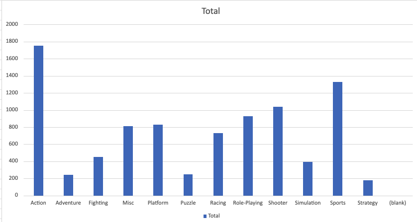

# Анализ продаж видеоигр (Video Game Sales)
https://www.kaggle.com/datasets/gregorut/videogamesales (Источник данных)

# Описание
Анализ датасета с продажами видеоигр (16 500+ записей) с целью определить, 
какие жанры и платформы показывают лучшие глобальные продажи.

## Инструменты
Excel / Google Sheets - Pivot Tables, графики

## Процесс
1. Импортировал датасет с Kaggle (vgsales.csv)
2. Проверил данные на корректность типов (числа vs текст), убедился что 
   все значения продаж читаются как числа, а не текст
3. Построил сводную таблицу: Genre → Sum of Global_Sales
4. Построил сводную таблицу: Platform → Sum of Global_Sales
5. Визуализировал обе через столбчатые диаграммы

## Ключевые выводы
- Жанр Action лидирует по суммарным глобальным продажам (1751 млн), 
  за ним следует Sports (1330 млн)
- Среди платформ лидируют PS2, Wii и X360 — это объясняется их долгим 
  жизненным циклом и широкой установленной базой консолей
- Жанры Strategy и Puzzle показывают наименьшие продажи — нишевые категории

## Файлы
- `vgsales.csv` — исходные данные
- `vg-sales.xlsx` — файл с расчётами и графиками
- `screenshots/` — скриншоты сводных таблиц
